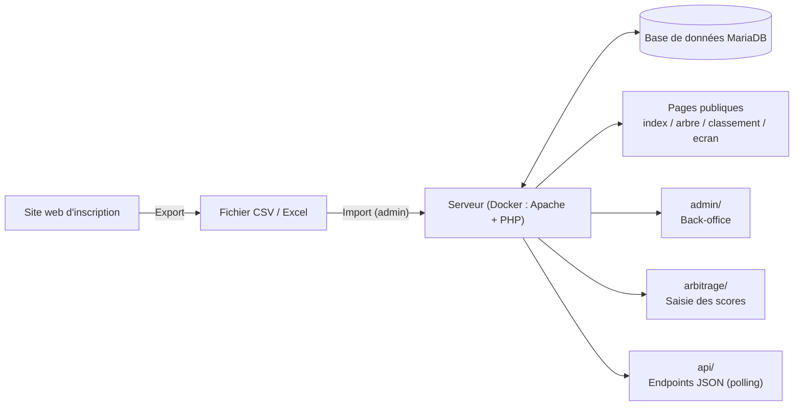
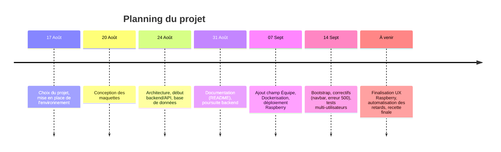

# Cahier des charges — Webapp Arbitrage Sabre Laser

**Projet :** 2026-27_I.DA-P3B_LuTo
**Équipe :** Tom & Lucas
**Établissement :** CFPT-AWEB-PH
**Documents liés :** [Journal de bord](https://github.com/CFPT-AWEB-PH/2026-27_I.DA-P3B_LuTo/blob/main/journalDeBord.md) · [README technique](https://github.com/CFPT-AWEB-PH/2026-27_I.DA-P3B_LuTo/blob/main/README.md)

---

## Sommaire

1. [Contexte et présentation](#1-contexte-et-présentation)
2. [Objectifs du projet](#2-objectifs-du-projet)
3. [Utilisateurs cibles](#3-utilisateurs-cibles)
4. [Besoins fonctionnels](#4-besoins-fonctionnels)
5. [Besoins non fonctionnels](#5-besoins-non-fonctionnels)
6. [Contraintes techniques](#6-contraintes-techniques)
7. [Architecture générale](#7-architecture-générale)
8. [Modèle de données](#8-modèle-de-données)
9. [Planning prévisionnel](#9-planning-prévisionnel)
10. [Livrables](#10-livrables)
11. [Répartition des rôles](#11-répartition-des-rôles)
12. [Risques identifiés](#12-risques-identifiés)
13. [Critères de réussite / recette](#13-critères-de-réussite--recette)

---

## 1. Contexte et présentation

Dans le cadre du module de projet, l'équipe (Tom & Lucas) développe une application web de **gestion et d'arbitrage de tournois de sabre laser**. L'application doit permettre de gérer l'ensemble du cycle de vie d'un tournoi : inscription des participants, génération de l'arbre de tournoi, arbitrage des combats en temps réel, affichage public des scores et classement final.

Le projet s'appuie également sur l'atelier Raspberry Pi suivi en parallèle : l'application est pensée pour être déployée et exécutée de manière autonome sur un Raspberry Pi en salle, via Docker.

## 2. Objectifs du projet

- Permettre l'**inscription** des participants à un tournoi via un fichier CSV/Excel importable.
- Générer et afficher un **arbre de tournoi** (bracket) clair et lisible par le public.
- Fournir aux **arbitres** un outil simple pour noter les combats en temps réel (3 arbitres par combat : 1 central + 2 coins).
- Afficher en **continu** sur un écran de salle les combats en cours, à venir, et les scores.
- Donner à l'**administrateur** un contrôle complet sur le déroulement du tournoi (paramètres, participants, combats) sans intervention sur le code.
- Rendre l'application **déployable facilement** (Docker) sur un Raspberry Pi, pour un usage autonome sans dépendance à une infrastructure externe.

## 3. Utilisateurs cibles

| Profil | Besoins principaux |
|---|---|
| **Public / spectateurs** | Consulter l'arbre du tournoi, le classement, l'écran d'affichage des combats |
| **Joueurs** | Être inscrits et visibles dans le tournoi, suivre leurs combats et leur classement |
| **Arbitres** | Saisir les points par manche pour les combats qui leur sont assignés |
| **Administrateur** | Gérer les participants, générer/planifier les combats, configurer les paramètres du tournoi, gérer les comptes utilisateurs |

## 4. Besoins fonctionnels

### 4.1 Inscription & import des participants
- Import d'un fichier CSV contenant les informations des joueurs (pseudo, nom, prénom, sexe, date de naissance, poids, grade, équipe).
- Validation et gestion des erreurs d'import (format invalide, champs manquants).

### 4.2 Gestion du tournoi (admin)
- Création, modification et suppression des combats.
- Génération/édition de l'arbre de tournoi (tour, position).
- Appariement automatique des joueurs selon des critères configurables (écart de poids, d'âge, de grade, même sexe).
- Gestion des retards : signalement et répercussion sur les horaires des combats suivants.
- Gestion des comptes utilisateurs (admin, arbitre) et des grades.
- Configuration des paramètres globaux du tournoi (durée d'un combat, points max, fréquence de rafraîchissement, etc.).

### 4.3 Arbitrage
- Attribution de 3 arbitres par combat (1 central + 2 coins).
- Saisie des points par manche, par arbitre.
- Calcul automatique de la moyenne des notes une fois les 3 arbitres votés.
- Détermination du vainqueur du combat.

### 4.4 Affichage public
- Page d'accueil présentant le tournoi.
- Arbre de tournoi consultable par tous, mis à jour au fil des résultats.
- Classement des joueurs (victoires, défaites, points cumulés).
- Écran d'affichage salle : rotation automatique entre combats en cours, à venir et scores, actualisé en continu (polling).

### 4.5 Authentification
- Connexion / déconnexion pour les comptes admin et arbitre.
- Gestion des droits d'accès selon le rôle (public, arbitre, admin).

## 5. Besoins non fonctionnels

- **Performance** : l'actualisation des données en temps réel (scores, chronomètre) doit rester fluide même avec plusieurs écrans/clients connectés simultanément.
- **Fiabilité** : gestion propre des erreurs (ex. erreur 500 sur import CSV, id de combat manquant ou invalide → réponses HTTP 400/404 explicites).
- **Compatibilité** : interface utilisable aussi bien en environnement ordinateur (administration, écran salle) qu'en format téléphone (consultation par le public / arbitres), avec une navigation responsive (Bootstrap).
- **Portabilité** : déploiement identique entre poste de développement et Raspberry Pi grâce à Docker.
- **Sécurité** : mots de passe hashés, accès aux pages sensibles (`admin/`, `arbitrage/`) restreint par rôle via `includes/auth.php`.
- **Maintenabilité** : configuration du tournoi centralisée dans une table `parametres` modifiable sans toucher au code.

## 6. Contraintes techniques

| Contrainte | Détail |
|---|---|
| Langage backend | PHP natif (pas de framework) |
| Base de données | MariaDB / MySQL |
| Frontend | HTML / CSS / JavaScript, Bootstrap |
| Conteneurisation | Docker (`Dockerfile`, `docker-compose.yml`, `apache.conf`) |
| Hébergement cible | Raspberry Pi (réseau local, salle du tournoi) |
| Échange de données initial | Fichier CSV/Excel exporté depuis un site d'inscription externe |

## 7. Architecture générale

## 8. Modèle de données

Base `sabre_arbitrage` (MariaDB) — tables principales : `users`, `grades`, `joueurs`, `combats`, `combat_arbitres`, `points`, `manches_resultats`, `parametres`.

Le diagramme entité-relation complet est disponible dans le [journal de bord](https://github.com/CFPT-AWEB-PH/2026-27_I.DA-P3B_LuTo/blob/main/journalDeBord.md) et le schéma SQL dans `sql/schema.sql`.

## 9. Planning prévisionnel

## 10. Livrables

- Code source de l'application (dépôt Git).
- Schéma de base de données (`sql/schema.sql`) et scripts de migration.
- Configuration Docker (`Dockerfile`, `docker-compose.yml`, `apache.conf`).
- README technique et journal de bord tenus à jour.
- Application déployée et fonctionnelle sur le Raspberry Pi.

## 11. Répartition des rôles

| Membre | Domaine principal |
|---|---|
| **Lucas** | Backend / API, CSS, Dockerisation, frontend (Bootstrap, navigation) |
| **Tom** | Maquettes, import CSV, base de données, déploiement Raspberry, tests |

Les deux membres contribuent conjointement à la documentation (journal de bord, README).

## 12. Risques identifiés

| Risque | Impact | Mitigation |
|---|---|---|
| Interface non adaptée au format Raspberry/mobile | Mauvaise expérience utilisateur en salle | Intégration de Bootstrap, tests responsive réguliers |
| Erreurs lors de l'import CSV (formats de fichier variables) | Blocage de l'inscription des participants | Validation stricte du format, messages d'erreur clairs (déjà rencontré : erreur 500) |
| Retards dans le déroulement des combats | Décalage de tout le planning du tournoi | Automatisation du décalage des matchs à partir du paramètre `retard_minutes` |
| Accès concurrent de plusieurs utilisateurs (arbitres, public) | Incohérence des données affichées | Tests multi-utilisateurs, polling régulier de l'API |
| Dépôt Git privé bloquant le clonage sur le Raspberry | Retard de déploiement | Connexion authentifiée depuis le Raspberry (déjà résolu) |

## 13. Critères de réussite / recette

- [ ] Un fichier CSV de participants peut être importé sans erreur, champ "Équipe" inclus.
- [ ] L'arbre de tournoi se génère et se met à jour automatiquement après chaque combat.
- [ ] Un combat peut être arbitré de bout en bout par 3 arbitres avec calcul correct de la moyenne.
- [ ] L'écran d'affichage salle actualise en continu les combats en cours/à venir et les scores.
- [ ] L'interface reste utilisable et lisible en format téléphone comme en format ordinateur.
- [ ] L'application se déploie via `docker compose up` sans configuration manuelle supplémentaire.
- [ ] Les retards sont pris en compte automatiquement dans la planification des combats suivants.
