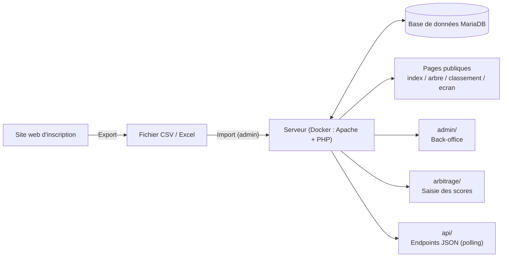

# 2026-27_I.DA-P3B_LuTo

**Webapp-arbitrage** — Plateforme de gestion de tournoi de sabre laser (inscriptions, arbitrage, classement, affichage public), développée en PHP natif avec base MariaDB.

**Auteurs :** Lucas & Tom
**Journal de bord :** [journalDeBord.md](https://github.com/CFPT-AWEB-PH/2026-27_I.DA-P3B_LuTo/blob/main/journalDeBord.md)

---

## Sommaire

1. [Présentation](#1-présentation)
2. [Fonctionnalités](#2-fonctionnalités)
3. [Stack technique](#3-stack-technique)
4. [Architecture](#4-architecture)
5. [Structure du projet](#5-structure-du-projet)
6. [Découpage par responsabilité](#6-découpage-par-responsabilité)
7. [Base de données](#7-base-de-données)
8. [Installation & démarrage](#8-installation--démarrage)
9. [Rôles utilisateurs](#9-rôles-utilisateurs)
10. [Points d'architecture à noter](#10-points-darchitecture-à-noter)
11. [Roadmap / à faire](#11-roadmap--à-faire)

---

## 1. Présentation

Application web de gestion d'arbitrage et de tournois de sabre laser (combats, joueurs, classement, arbre de tournoi), développée en **PHP natif**, avec une base de données **MariaDB**, conteneurisée via **Docker**.

Les participants s'inscrivent via un site web dédié ; les données sont exportées en CSV puis importées par l'administrateur pour démarrer le tournoi (voir [journal de bord](https://github.com/CFPT-AWEB-PH/2026-27_I.DA-P3B_LuTo/blob/main/journalDeBord.md) pour le détail des choix d'architecture).

## 2. Fonctionnalités

- **Inscription & import** des participants via fichier CSV/Excel (avec champ Équipe).
- **Arbre de tournoi** (bracket) généré automatiquement à partir des combats.
- **Classement public** des joueurs (victoires, défaites, points cumulés).
- **Écran d'affichage salle** en continu (combats en cours, à venir, scores).
- **Interface d'arbitrage** : saisie des points par manche, par 3 arbitres (1 central + 2 coins), calcul de la moyenne.
- **Dashboard administrateur** : gestion des combats, joueurs, utilisateurs et paramètres du tournoi (durée des combats, points max, écarts d'appariement, gestion des retards, etc.), le tout configurable sans toucher au code.
- **API interne temps réel** (polling) pour l'état des combats (statut, scores, temps restant, vainqueur).

## 3. Stack technique

| Composant | Technologie |
|---|---|
| Backend | PHP natif |
| Base de données | MySQL / MariaDB (fichiers `.sql` de migration + schéma) |
| Frontend | HTML/CSS/JS + Bootstrap (dossier `assets/css`, `assets/js`) |
| Authentification | Système maison (`includes/auth.php`) |
| API interne | Endpoints PHP dédiés (dossier `api/`), réponses JSON |
| Conteneurisation | Docker (`Dockerfile`, `docker-compose.yml`, `apache.conf`) |

## 4. Architecture



Le site est déployé sur un **Raspberry Pi** via Docker, ce qui permet un usage autonome en salle sans dépendre d'une infrastructure externe.

## 5. Structure du projet

```
webapp-arbitrage/
├── admin/              # Back-office (gestion combats, joueurs, users, paramètres)
├── api/                # Endpoints API internes (ex: get_combat_status.php)
├── arbitrage/          # Interface de saisie/consultation pour les arbitres
├── assets/             # Ressources statiques (css/, js/)
├── config/             # Configuration (config.php, database.php)
├── includes/           # Composants partagés (auth, header, footer, fonctions utilitaires, icônes)
├── sql/                # Schéma de base + scripts de migration
├── arbre.php           # Arbre de tournoi
├── classement.php      # Classement des joueurs
├── combat.php          # Détail/affichage d'un combat
├── ecran.php           # Écran d'affichage
├── index.php           # Page d'accueil
├── login.php / logout.php / register.php  # Gestion des sessions utilisateurs
├── scores.php          # Gestion/affichage des scores
├── Dockerfile
├── docker-compose.yml
├── apache.conf
└── README.md
```

## 6. Découpage par responsabilité

- **`admin/`** — Toutes les opérations de gestion réservées aux administrateurs : combats, joueurs, paramètres, utilisateurs. Utilise un système d'onglets (`_tabs.php`) et vérifie les droits via `includes/auth.php`.
- **`arbitrage/`** — Interface dédiée aux arbitres pour la saisie des résultats en temps réel (`saisie.php`) et la consultation (`index.php`).
- **`api/`** — Endpoints PHP retournant du JSON, consommés en Ajax/JS par le frontend pour du polling en temps réel.
  - `get_combat_status.php` : reçoit un `id` de combat en `GET`, purge d'abord les combats expirés (`purgerCombatsExpires`), récupère le combat (`getCombat`), puis renvoie son statut, les scores des deux joueurs, le temps restant (`tempsRestant`), le vainqueur (id + pseudo) et la manche en cours. Gère les erreurs 400 (id manquant) et 404 (combat introuvable).
- **`config/`** — Centralise la connexion base de données (`database.php`) et les constantes/paramètres globaux (`config.php`).
- **`includes/`** — Fichiers inclus dans plusieurs pages : authentification, layout (header/footer), fonctions utilitaires communes, gestion des icônes.
- **`sql/`** — Le schéma initial (`schema.sql`) et les migrations versionnées (arbre, matchmaking, config polling, profils) témoignent d'une évolution incrémentale de la base.
- **Racine** — Pages "métier" directement accessibles (arbre de tournoi, classement, écran, scores, login/logout/register).

## 7. Base de données

Base `sabre_arbitrage` (MariaDB), principales tables :

| Table | Rôle |
|---|---|
| `users` | Comptes (admin, arbitre, joueur, public) |
| `grades` | Niveaux/ceintures, configurables |
| `joueurs` | Fiche de combat d'un participant (indépendante d'un compte `users`) |
| `combats` | Un combat : joueurs, statut, scores, tour/position dans l'arbre |
| `combat_arbitres` | Affectation des 3 arbitres (central, coin1, coin2) à un combat |
| `points` | Notes données par chaque arbitre, par manche |
| `manches_resultats` | Moyenne des notes par manche une fois les 3 arbitres votés |
| `parametres` | Réglages globaux clé/valeur (durée combat, points max, écarts d'appariement, retard, etc.) |

Le schéma complet est disponible dans `sql/schema.sql`. Le détail du diagramme entité-relation est documenté dans le [journal de bord](https://github.com/CFPT-AWEB-PH/2026-27_I.DA-P3B_LuTo/blob/main/journalDeBord.md).

## 8. Installation & démarrage

```bash
# Cloner le dépôt
git clone https://github.com/CFPT-AWEB-PH/2026-27_I.DA-P3B_LuTo.git
cd 2026-27_I.DA-P3B_LuTo

# Lancer les conteneurs (Apache + PHP + MariaDB)
docker compose up -d --build

# Le schéma est importé automatiquement au premier démarrage
# via sql/schema.sql (voir docker-compose.yml)
```

Compte administrateur par défaut : `admin` / `admin123` (**à changer immédiatement en production**).

L'application est ensuite accessible sur `http://localhost` (ou l'adresse IP du Raspberry sur le réseau local).

## 9. Rôles utilisateurs

| Rôle | Accès |
|---|---|
| `public` | `index.php`, `arbre.php`, `classement.php`, `ecran.php` |
| `arbitre` | Accès public + `arbitrage/` (saisie des points) |
| `admin` | Accès complet, dont `admin/` (gestion combats, joueurs, users, paramètres) |

## 10. Points d'architecture à noter

- **Séparation admin / arbitrage / public** claire au niveau des dossiers, ce qui facilite la gestion des droits d'accès.
- **Paramétrage sans code** : la table `parametres` permet d'ajuster le comportement du tournoi (durée des combats, écarts de poids/âge/grade pour l'appariement automatique, intervalle de rafraîchissement, retard cumulé) depuis le dashboard admin.
- **Polling temps réel** : le frontend interroge régulièrement `api/get_combat_status.php` plutôt que d'utiliser des websockets, ce qui simplifie le déploiement sur Raspberry.
- **Déploiement conteneurisé** (Docker) pour un environnement reproductible entre le poste de développement et le Raspberry en salle.

## 11. Roadmap / à faire

- [ ] Ajouter le champ `Equipe` à l'import CSV et à la table `joueurs`.
- [ ] Adapter l'UX/UI pour l'affichage sur le format Raspberry.
- [ ] Automatiser le décalage des matchs en cas de retard (paramètre `retard_minutes`).
- [ ] Finaliser la navbar responsive (bouton mobile actuellement aussi visible en format ordinateur).
- [ ] Étendre les tests multi-utilisateurs.
