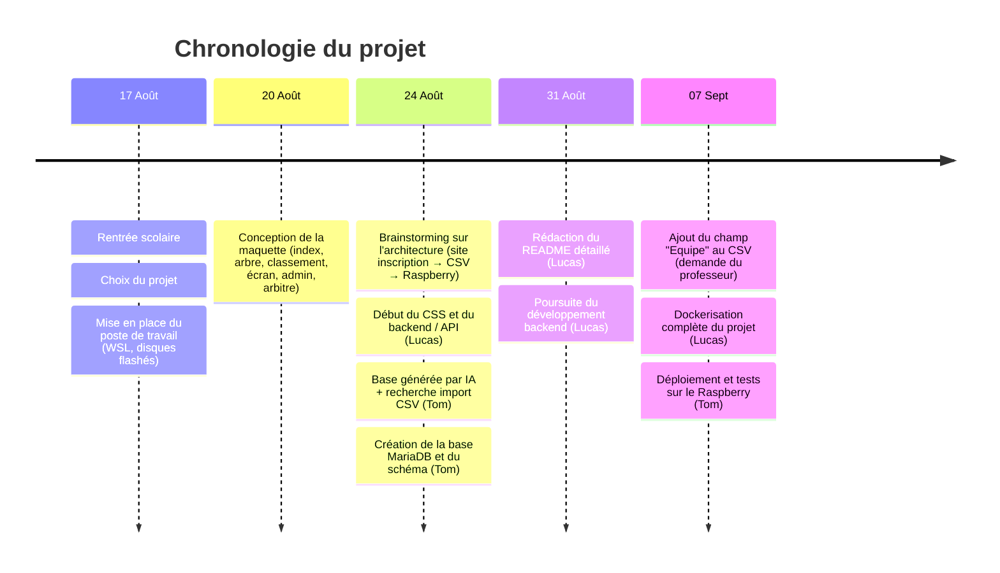
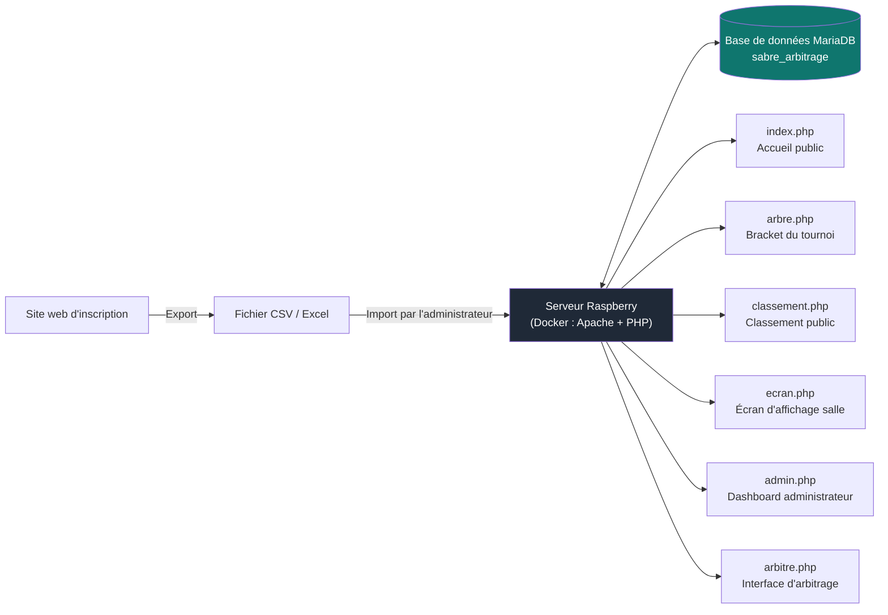
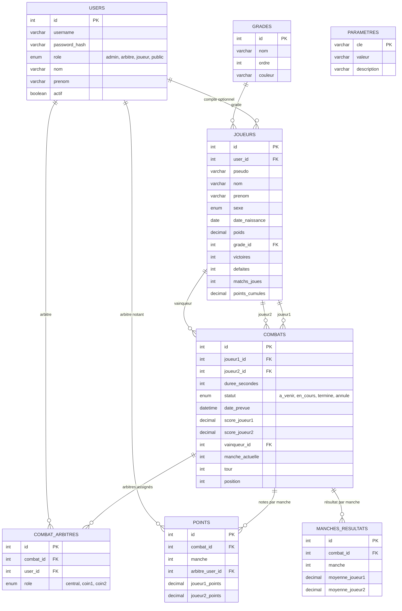

# Journal de bord — Projet Sabre Laser Arbitrage

**Projet :** Plateforme web de gestion de tournoi de sabre laser (inscription, arbitrage, classement, affichage public)
**Équipe :** Tom & Lucas
**Infrastructure cible :** Raspberry Pi (Docker : Apache/PHP + MariaDB)

---

## 1. Chronologie du projet

---

## 2. Architecture générale du système

Le choix s'est porté sur une architecture en deux temps plutôt que sur une solution centralisée dès l'inscription : les participants s'inscrivent via un site web séparé, dont les données sont exportées en CSV, puis importées manuellement par l'administrateur sur le serveur du tournoi hébergé sur le Raspberry. Ce découplage simplifie la phase d'inscription (accessible sans dépendre de la disponibilité du Raspberry) et laisse à l'administrateur le contrôle du moment où le tournoi démarre.

---

## 3. Schéma de la base de données (MariaDB)

Points clés du schéma :
- La table `joueurs` est **indépendante** du compte utilisateur (`users`) : un joueur peut exister sans compte, ce qui correspond au flux d'inscription par CSV.
- Chaque combat est jugé par **3 arbitres** (1 central + 2 coins), via `combat_arbitres`, et chaque arbitre note indépendamment dans `points` avant qu'une moyenne soit calculée dans `manches_resultats`.
- La table `parametres` permet de configurer l'application (durée des combats, écarts de poids/âge/grade pour l'appariement automatique, intervalle de rafraîchissement, retard cumulé, etc.) **sans toucher au code**, directement depuis le dashboard admin.
- Les champs `tour` et `position` dans `combats` permettent de reconstituer l'arbre du tournoi (bracket) affiché sur `arbre.php`.

---

## 4. Journal détaillé

### 17.08 — Rentrée scolaire

**Choix du projet**
Nous avons choisi ce projet car nous le trouvons particulièrement intéressant. Il présente aussi l'avantage de pouvoir intégrer le projet de l'atelier Raspberry directement au site web, ce qui a été un facteur déterminant dans notre motivation à le sélectionner.

**Mise en place du poste de travail**
- Installation des disques durs flashés
- Installation de WSL (Windows Subsystem for Linux)
- Configuration générale de l'environnement de développement

---

### 20.08 — Conception de la maquette

**Lucas :** absent.

**Tom :** mise en place de la maquette générale du site, définissant les six pages principales de l'application et leurs niveaux d'accès :

- `index.php` (page principale), accessible à tout le monde :
  
- `arbre.php` (visualisation en style "arbre"), accessible à tout le monde, inspiré des images de grands tournois (coupe du monde, etc.) :
  
- `classement.php`, accessible à tout le monde :
  
- `ecran.php`, écran d'affichage (ex : écran principal de la salle) qui affiche en continu les matchs en cours, ceux à venir et les scores
- `admin.php` / dashboard, page accessible uniquement à l'admin, permet de gérer le tournoi, lancer des matchs, modifier les participants, changer les paramètres du tournoi :
  
- `arbitre.php`, accessible uniquement aux admins ainsi qu'aux arbitres, sert à arbitrer les matchs, donner des points aux participants.

---

### 24.08 — Brainstorming architecture & débuts du développement

**Réflexion sur l'infrastructure**
La première idée envisagée consistait en une architecture centralisée sur une seule machine (tout sur le Raspberry). Après discussion, nous avons retenu une architecture en deux étapes :

> **Site web d'inscription → Fichier Excel/CSV → Serveur Raspberry du tournoi**

Cette approche facilite l'inscription des participants : l'administrateur n'a plus qu'à importer le fichier CSV final pour démarrer le tournoi, sans dépendre de la disponibilité du Raspberry pendant toute la phase d'inscription.

Infrastructure :

*(voir aussi le schéma Mermaid équivalent en section 2)*

**Lucas :**
- Reprise et modification du CSS initialement généré par Tom, avec passage à un thème monochrome plus professionnel, en cohérence avec la maquette.
- Développement du backend, notamment de l'API : celle-ci retourne, pour un combat identifié par son `id`, son statut, le score des deux joueurs, le temps restant, le vainqueur, etc.

**Tom :**
- Génération, via l'intelligence artificielle, d'une base de code exploitable pour le projet. Cette base contenait de nombreux problèmes et a nécessité d'être largement reprise, mais a fourni un point de départ utile, notamment pour le style CSS.
- **Problème rencontré :** l'importation d'un fichier CSV vers PHP. La documentation officielle de PHP a permis d'avancer, en particulier :
  - les [fonctions du système de fichiers](https://www.php.net/manual/en/ref.filesystem.php)
  - la fonction [`fgetcsv`](https://www.php.net/manual/en/function.fgetcsv.php)
- Démarrage du développement du backend et de la base de données : création de la base **MariaDB** et conception du schéma (voir section 3).

---

### 31.08 — Documentation & backend

**Lucas :**
- Rédaction plus poussée du `README.md` : ajout d'une documentation détaillée sur les technologies utilisées et l'architecture du projet.
- Poursuite du développement du backend.

**Tom :** absent.

---

### 07.09 — Retours du professeur & industrialisation

**Brainstorming avec le professeur**
Trois points d'amélioration ont été identifiés :
1. Ajouter un champ **"Equipe"** au CSV d'inscription.
2. Adapter l'UX/UI de l'interface web à la **version Raspberry** (actuellement non optimisée).
3. **Automatiser la gestion des retards** : puisque l'heure de démarrage de chaque combat est connue, il devient possible de décaler automatiquement les matchs suivants plutôt que de saisir manuellement le temps de retard (voir le paramètre `retard_minutes` en base).

**Lucas :**
- Implémentation de **Docker** pour le projet : ajout d'un `Dockerfile`, d'un `docker-compose.yml` et d'un `apache.conf`.
- Tâche longue (une grande partie de l'après-midi), la dernière utilisation de Docker par l'équipe remontant à un certain temps.

**Tom :**
- Déploiement du site web sur le Raspberry, avec constat que l'interface n'est pas encore adaptée à ce format.
- Installation de Docker sur le Raspberry et lancement de l'installation du projet.
- **Problèmes rencontrés :**
  - Impossible de cloner le dépôt (privé) directement depuis le Raspberry → résolu en se connectant au Raspberry avec les identifiants appropriés.
  - Complications réseau : nécessité d'alterner entre le port du PC et celui du Raspberry → résolu en utilisant un poste de travail inutilisé dédié.

---

## 5. Prochaines étapes

- [ ] Ajouter le champ `Equipe` à l'import CSV et à la table `joueurs`
- [ ] Adapter l'UX/UI pour l'affichage sur le format Raspberry
- [ ] Automatiser le décalage des matchs en cas de retard (utilisation du paramètre `retard_minutes`)
- [ ] Finaliser l'interface `arbitre.php` (saisie des points par manche, moyenne des 3 arbitres)
- [ ] Finaliser l'affichage `arbre.php` à partir des champs `tour` / `position`
