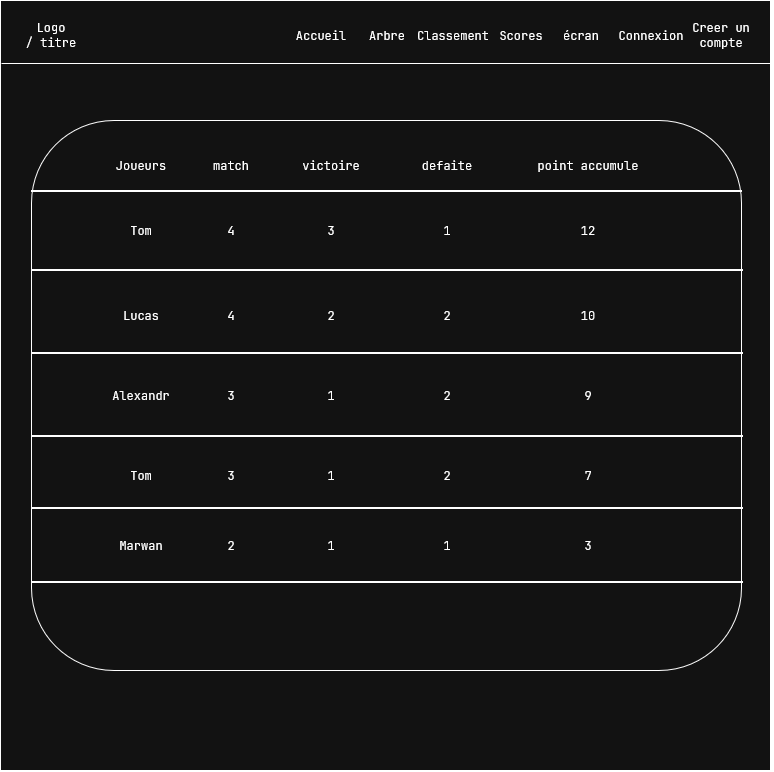
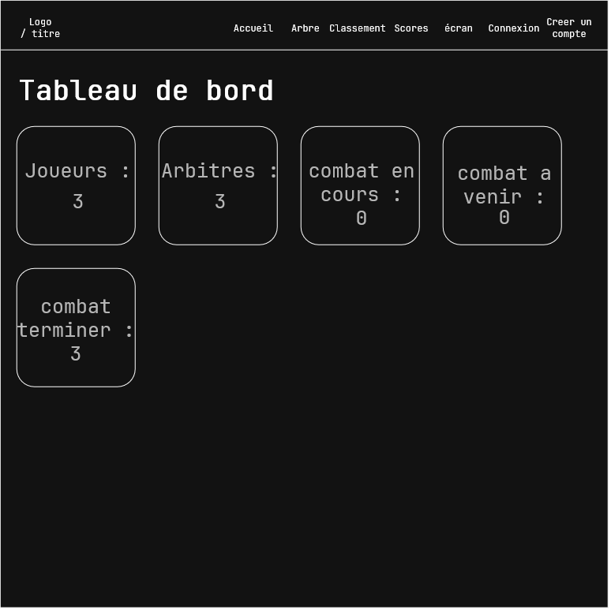

# Journal de bord

# 17.08:

## rentrée scolaire : 
- choix du projet :
   - nous avons choisis ce projet car nous le trouvons intéressant, de plus, on pourra intégrer le projet de l'atelier Raspberry au site web, ce qui nous a motiver a prendre ce projet.
- mise en place du poste de travail :
   - installation des disque durs flashé:
        - installation de wsl
        - etc

# 20.08:

## Lucas : 
- abscent
## Tom : 
- Mise en place de la maquette :
-  Index.php  (page principal) accessible a tout le monde :
  
- arbre.php (visualisation en style "arbre") accessible par tout le monde, inspiré des images de grand tournois (coupe du monde, etc) :
  
-  classement.php, accessible par tout le monde
  
- écran.php, écran d'affichage (ex : écran principal de la salle) qui affiche en continue, les matche en cours, ceux a venir et les scores
- admin.php / dashboard, page accessible uniquement au admin, permet de gérer le tournois, lancer des matches, modifier les participant, changer les paramètres du tournois.
  
- arbitre.php, accessible uniquement aux admin ainsi que aux arbitres, sers a arbitrer les matches, donner des points au participants.

# 24.08:

## Brainstorming :
- Nous avons réfléchie a l'infrastructure du site web.
     - premièrement on pensais faire une architecture sur une seul machine, tout centralise sur le Raspberry, au final on est partie sur une architecture comme la suivante ↓
- site web inscription -> fichier Excel -> serveur Raspberry du tournoi
     - réflexion derrière ce choix : cela facilitera l'inscription de participant, car ensuite l'administrateur n'aura qu'a importer le fichier csv final et commencer le tournois.
- infrastructure  : 
## Lucas :
- Lucas a commencer a modifié le CSS crée ( / générer ) par Tom :
   - Changement de toute l'interface pour correspondre au maquette
   - Changement du CSS pour un thème plus "monochrome", plus correspondant a un site professionnel
   - dévlopement du backend notamment l'api:
        - l'api retourne sur un match renseigne via son id, celle si retourne notamment son status, le score des deux joueurs, le temps restant, le vainqueur etc    
## Tom :
   - Tom a générer grâce a l'intelligence artificiel, une base utilisable du projet, celle ci ayant pleins de problème devra être complétement modifier, mais elle donne une pour le style css, par exemple.
   - problème rencontrer : l'importation d'un fichier csv en donne php :
        - la documentation de php présente des fonctions qui nous sers pour résoudre ce probleme :
        - [premier liens](https://www.php.net/manual/en/ref.filesystem.php) les fonctions filesysteme.
        - et notamment la fonction [fgetcsv](https://www.php.net/manual/en/function.fgetcsv.php)
     - Commencement du développement du backend / base de donnée, création du la base mariadb, et de la création du schème de db.

# 31.08:

## Lucas:
- Création et rédaction plus poussé du README.MD.
   - Ajouts d'une documentation plus poussé sur les technologie utilise pour ce projet, architecture du projet explique plus en détails
   - continuer le développement du backend
## tom:
- absent
