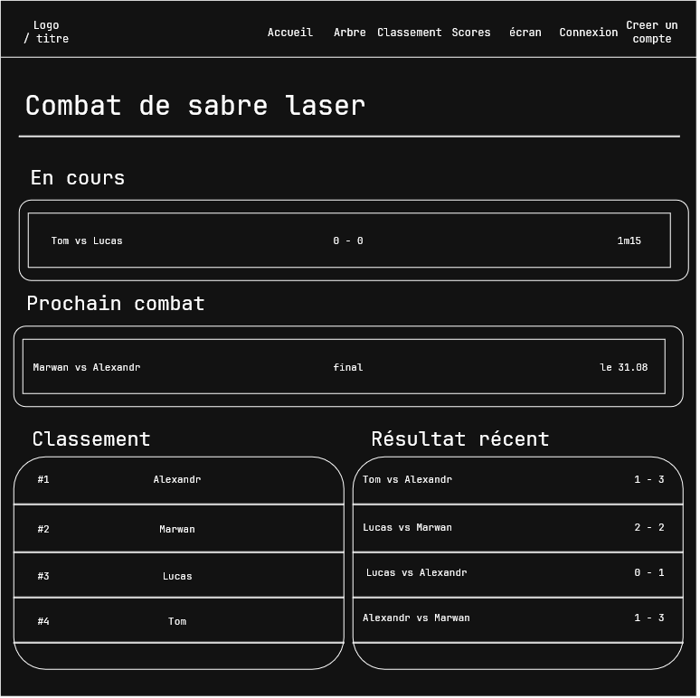
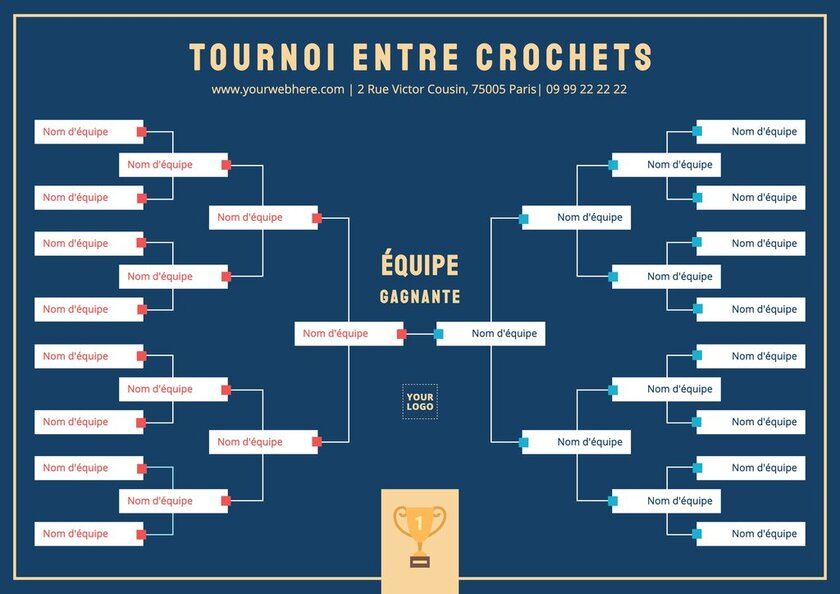
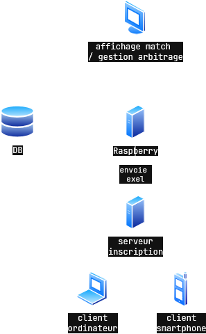

# Journal de bord

# 17.08
## rentrée scolaire : 
- choix du projet :
   - nous avons choisis ce projet car nous le trouvons intéressant, de plus, on pourra intégrer le projet de l'atelier Raspberry au site web, ce qui nous a motiver a prendre ce projet.
- mise en place du poste de travail :
   - installation des disque durs flashé:
        - installation de wsl
        - etc

# 20.08
## Lucas : 
- abscent
## Tom : 
- Mise en place de la maquette :
-  Index.php  (page principal) accessible a tout le monde :
  
- arbre.php (visualisation en style "arbre") accessible par tout le monde, inspiré des images de grand tournois (coupe du monde, etc) :
   

# 24.08:
## Brainstorming :
- Nous avons réfléchie a l'infrastructure du site web
- site web inscription -> fichier Excel -> serveur Raspberry du tournoi
- infrastructure  : 
## Lucas :
- Lucas a commencer a modifié le CSS crée ( / générer ) par Tom
## Tom :
   - Tom a commencer a devlopper le backend 
   - importation du sheet avec les participants
   - création des matches
