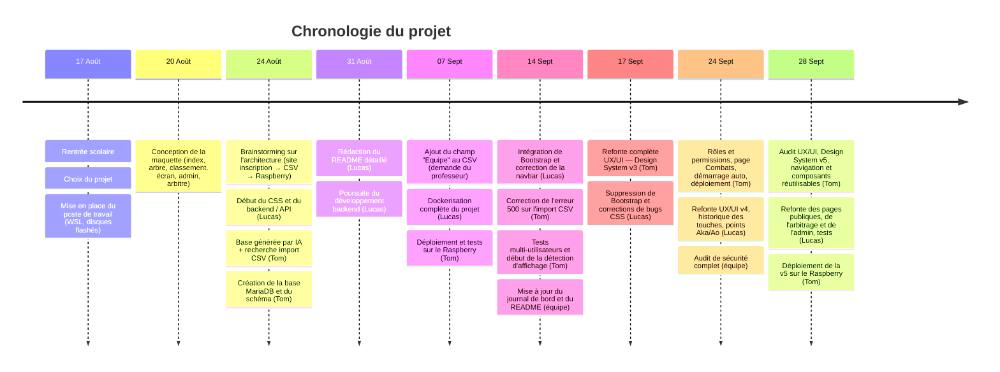
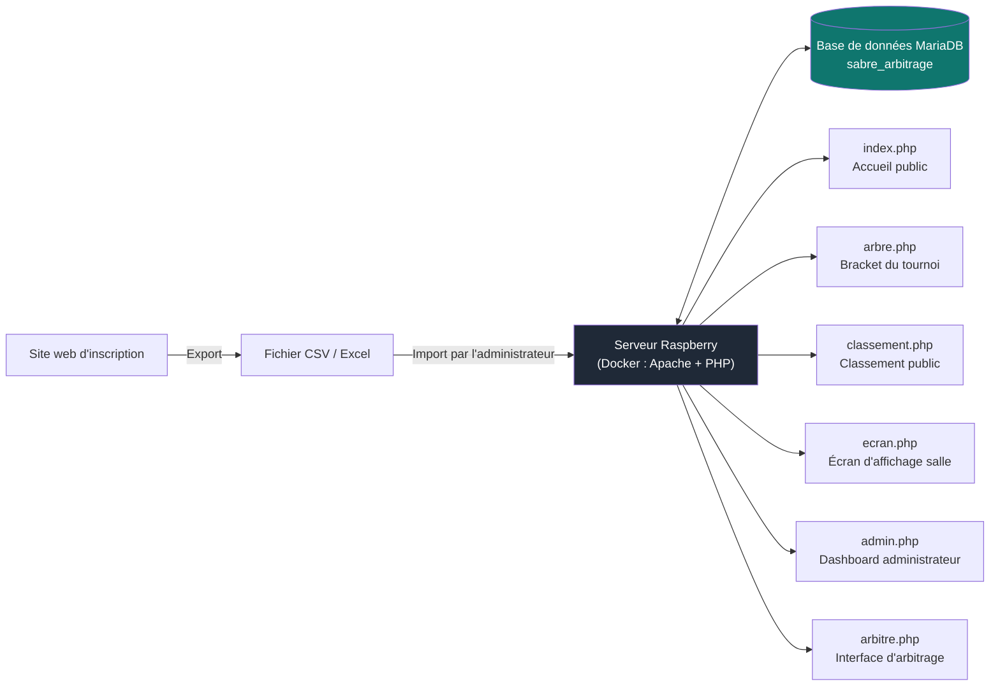
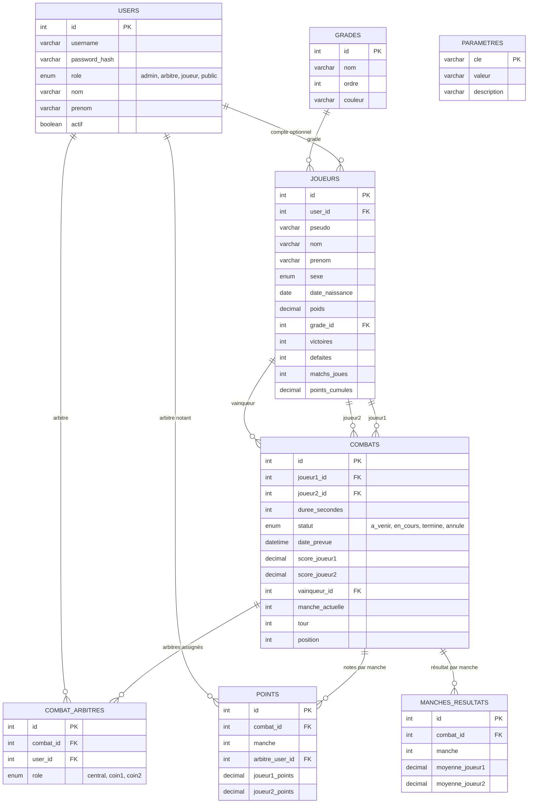
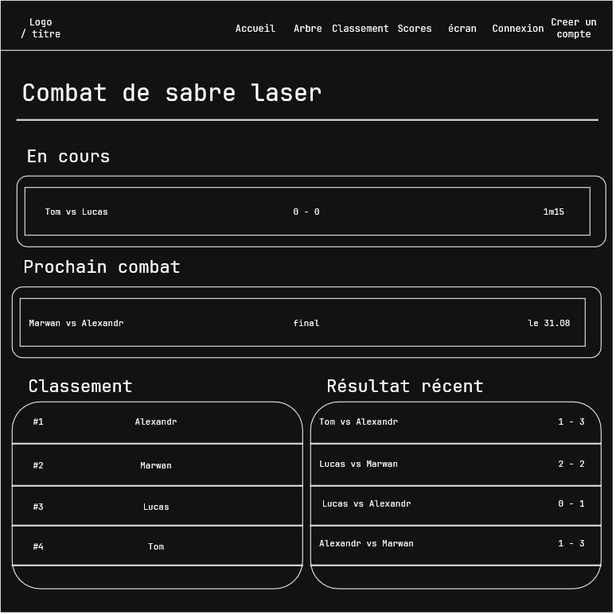
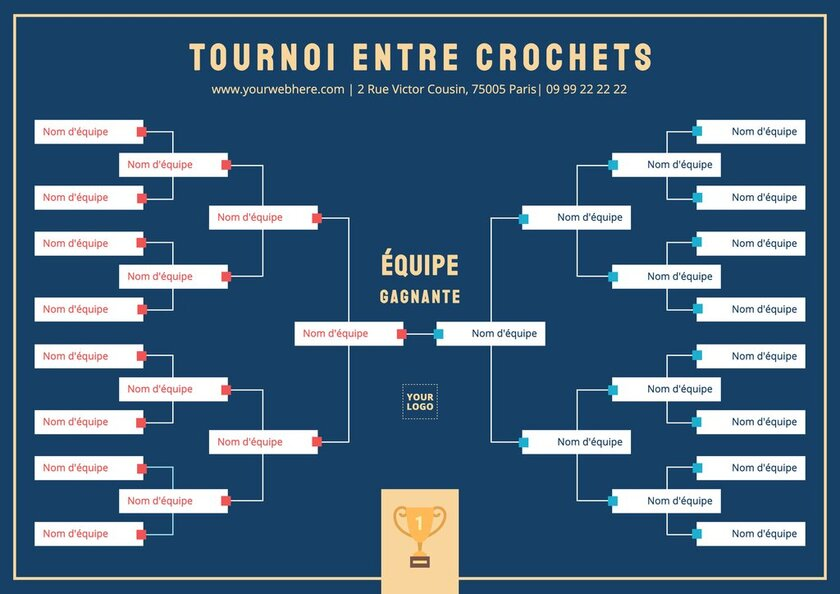
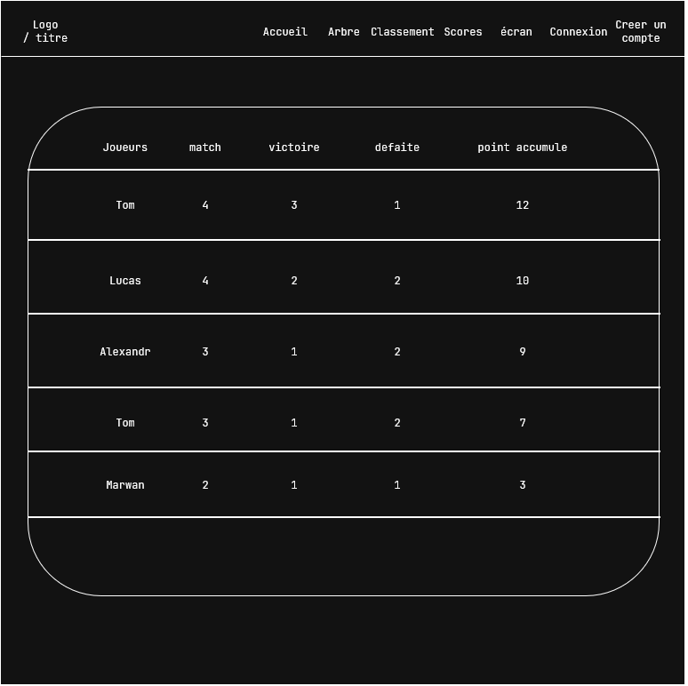
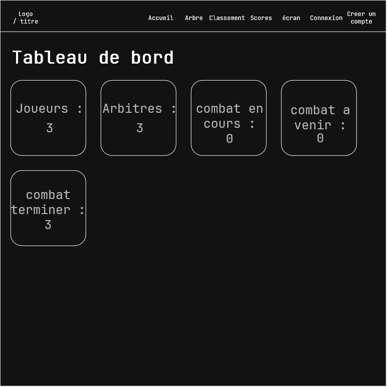
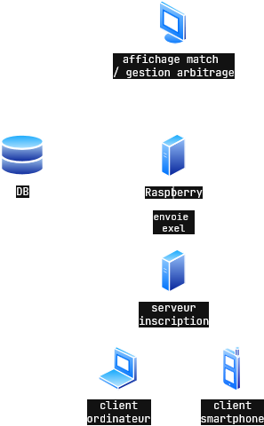

# Journal de bord — Projet Sabre Laser Arbitrage

**Projet :** Plateforme web de gestion de tournoi de sabre laser (inscription, arbitrage, classement, affichage public)
**Équipe :** Tom & Lucas
**Infrastructure cible :** Raspberry Pi (Docker : Apache/PHP + MariaDB)

---

## 1. Chronologie du projet

```mermaid
timeline
    title Chronologie du projet
    17 Août : Rentrée scolaire
            : Choix du projet
            : Mise en place du poste de travail (WSL, disques flashés)
    20 Août : Conception de la maquette (index, arbre, classement, écran, admin, arbitre)
    24 Août : Brainstorming sur l'architecture (site inscription → CSV → Raspberry)
            : Début du CSS et du backend / API (Lucas)
            : Base générée par IA + recherche import CSV (Tom)
            : Création de la base MariaDB et du schéma (Tom)
    31 Août : Rédaction du README détaillé (Lucas)
            : Poursuite du développement backend (Lucas)
    07 Sept : Ajout du champ "Equipe" au CSV (demande du professeur)
            : Dockerisation complète du projet (Lucas)
            : Déploiement et tests sur le Raspberry (Tom)
    14 Sept : Intégration de Bootstrap et correction de la navbar (Lucas)
            : Correction de l'erreur 500 sur l'import CSV (Tom)
            : Tests multi-utilisateurs et début de la détection d'affichage (Tom)
            : Mise à jour du journal de bord et du README (équipe)
    17 Sept : Refonte complète UX/UI — Design System v3 (Tom)
            : Suppression de Bootstrap et corrections de bugs CSS (Lucas)
    24 Sept : Rôles et permissions, page Combats, démarrage auto, déploiement (Tom)
            : Refonte UX/UI v4, historique des touches, points Aka/Ao (Lucas)
            : Audit de sécurité complet (équipe)
    28 Sept : Audit UX/UI, Design System v5, navigation et composants réutilisables (Tom)
            : Refonte des pages publiques, de l'arbitrage et de l'admin, tests (Lucas)
            : Déploiement de la v5 sur le Raspberry (Tom)
```

---

## 2. Architecture générale du système

```mermaid
flowchart LR
    A["Site web d'inscription"] -->|Export| B["Fichier CSV / Excel"]
    B -->|"Import par l'administrateur"| D["Serveur Raspberry<br/>(Docker : Apache + PHP)"]
    D <--> E[("Base de données MariaDB<br/>sabre_arbitrage")]

    D --> F["index.php<br/>Accueil public"]
    D --> G["arbre.php<br/>Bracket du tournoi"]
    D --> H["classement.php<br/>Classement public"]
    D --> I["ecran.php<br/>Écran d'affichage salle"]
    D --> J["admin.php<br/>Dashboard administrateur"]
    D --> K["arbitre.php<br/>Interface d'arbitrage"]

    style D fill:#1f2937,color:#fff
    style E fill:#0f766e,color:#fff
```

Le choix s'est porté sur une architecture en deux temps plutôt que sur une solution centralisée dès l'inscription : les participants s'inscrivent via un site web séparé, dont les données sont exportées en CSV, puis importées manuellement par l'administrateur sur le serveur du tournoi hébergé sur le Raspberry. Ce découplage simplifie la phase d'inscription (accessible sans dépendre de la disponibilité du Raspberry) et laisse à l'administrateur le contrôle du moment où le tournoi démarre.

---

## 3. Schéma de la base de données (MariaDB)

```mermaid
erDiagram
    USERS ||--o{ JOUEURS : "compte optionnel"
    GRADES ||--o{ JOUEURS : "grade"
    JOUEURS ||--o{ COMBATS : "joueur1"
    JOUEURS ||--o{ COMBATS : "joueur2"
    JOUEURS ||--o{ COMBATS : "vainqueur"
    COMBATS ||--o{ COMBAT_ARBITRES : "arbitres assignés"
    USERS ||--o{ COMBAT_ARBITRES : "arbitre"
    COMBATS ||--o{ POINTS : "notes par manche"
    USERS ||--o{ POINTS : "arbitre notant"
    COMBATS ||--o{ MANCHES_RESULTATS : "résultat par manche"

    USERS {
        int id PK
        varchar username
        varchar password_hash
        enum role "admin, arbitre, joueur, public"
        varchar nom
        varchar prenom
        boolean actif
    }
    GRADES {
        int id PK
        varchar nom
        int ordre
        varchar couleur
    }
    JOUEURS {
        int id PK
        int user_id FK
        varchar pseudo
        varchar nom
        varchar prenom
        enum sexe
        date date_naissance
        decimal poids
        int grade_id FK
        int victoires
        int defaites
        int matchs_joues
        decimal points_cumules
    }
    COMBATS {
        int id PK
        int joueur1_id FK
        int joueur2_id FK
        int duree_secondes
        enum statut "a_venir, en_cours, termine, annule"
        datetime date_prevue
        decimal score_joueur1
        decimal score_joueur2
        int vainqueur_id FK
        int manche_actuelle
        int tour
        int position
    }
    COMBAT_ARBITRES {
        int id PK
        int combat_id FK
        int user_id FK
        enum role "central, coin1, coin2"
    }
    POINTS {
        int id PK
        int combat_id FK
        int manche
        int arbitre_user_id FK
        decimal joueur1_points
        decimal joueur2_points
    }
    MANCHES_RESULTATS {
        int id PK
        int combat_id FK
        int manche
        decimal moyenne_joueur1
        decimal moyenne_joueur2
    }
    PARAMETRES {
        varchar cle PK
        varchar valeur
        varchar description
    }
```

Points clés du schéma :
- La table `joueurs` est **indépendante** du compte utilisateur (`users`) : un joueur peut exister sans compte, ce qui correspond au flux d'inscription par CSV.
- Chaque combat est jugé par **3 arbitres** (1 central + 2 coins), via `combat_arbitres`, et chaque arbitre note indépendamment dans `points` avant qu'une moyenne soit calculée dans `manches_resultats`.
- La table `parametres` permet de configurer l'application (durée des combats, écarts de poids/âge/grade pour l'appariement automatique, intervalle de rafraîchissement, retard cumulé, etc.) **sans toucher au code**, directement depuis le dashboard admin.
- Les champs `tour` et `position` dans `combats` permettent de reconstituer l'arbre du tournoi (bracket) affiché sur `arbre.php`.

---

## 4. Journal détaillé

### 17.08 — Rentrée scolaire

**Choix du projet**
Nous avons choisi ce projet car nous le trouvons particulièrement intéressant. Il présente aussi l'avantage de pouvoir intégrer le projet de l'atelier Raspberry directement au site web, ce qui a été un facteur déterminant dans notre motivation à le sélectionner.

**Mise en place du poste de travail**
- Installation des disques durs flashés
- Installation de WSL (Windows Subsystem for Linux)
- Configuration générale de l'environnement de développement

---

### 20.08 — Conception de la maquette

**Lucas :** absent.

**Tom :** mise en place de la maquette générale du site, définissant les six pages principales de l'application et leurs niveaux d'accès :

- `index.php` (page principale), accessible à tout le monde :
  
- `arbre.php` (visualisation en style "arbre"), accessible à tout le monde, inspiré des images de grands tournois (coupe du monde, etc.) :
  
- `classement.php`, accessible à tout le monde :
  
- `ecran.php`, écran d'affichage (ex : écran principal de la salle) qui affiche en continu les matchs en cours, ceux à venir et les scores
- `admin.php` / dashboard, page accessible uniquement à l'admin, permet de gérer le tournoi, lancer des matchs, modifier les participants, changer les paramètres du tournoi :
  
- `arbitre.php`, accessible uniquement aux admins ainsi qu'aux arbitres, sert à arbitrer les matchs, donner des points aux participants.

---

### 24.08 — Brainstorming architecture & débuts du développement

**Réflexion sur l'infrastructure**
La première idée envisagée consistait en une architecture centralisée sur une seule machine (tout sur le Raspberry). Après discussion, nous avons retenu une architecture en deux étapes :

> **Site web d'inscription → Fichier Excel/CSV → Serveur Raspberry du tournoi**

Cette approche facilite l'inscription des participants : l'administrateur n'a plus qu'à importer le fichier CSV final pour démarrer le tournoi, sans dépendre de la disponibilité du Raspberry pendant toute la phase d'inscription.

Infrastructure :

*(voir aussi le schéma Mermaid équivalent en section 2)*

**Lucas :**
- Reprise et modification du CSS initialement généré par Tom, avec passage à un thème monochrome plus professionnel, en cohérence avec la maquette.
- Développement du backend, notamment de l'API : celle-ci retourne, pour un combat identifié par son `id`, son statut, le score des deux joueurs, le temps restant, le vainqueur, etc.

**Tom :**
- Génération, via l'intelligence artificielle, d'une base de code exploitable pour le projet. Cette base contenait de nombreux problèmes et a nécessité d'être largement reprise, mais a fourni un point de départ utile, notamment pour le style CSS.
- **Problème rencontré :** l'importation d'un fichier CSV vers PHP. La documentation officielle de PHP a permis d'avancer, en particulier :
  - les [fonctions du système de fichiers](https://www.php.net/manual/en/ref.filesystem.php)
  - la fonction [`fgetcsv`](https://www.php.net/manual/en/function.fgetcsv.php)
- Démarrage du développement du backend et de la base de données : création de la base **MariaDB** et conception du schéma (voir section 3).

---

### 31.08 — Documentation & backend

**Lucas :**
- Rédaction plus poussée du `README.md` : ajout d'une documentation détaillée sur les technologies utilisées et l'architecture du projet.
- Poursuite du développement du backend.

**Tom :** absent.

---

### 07.09 — Retours du professeur & industrialisation

**Brainstorming avec le professeur**
Trois points d'amélioration ont été identifiés :
1. Ajouter un champ **"Equipe"** au CSV d'inscription.
2. Adapter l'UX/UI de l'interface web à la **version Raspberry** (actuellement non optimisée).
3. **Automatiser la gestion des retards** : puisque l'heure de démarrage de chaque combat est connue, il devient possible de décaler automatiquement les matchs suivants plutôt que de saisir manuellement le temps de retard (voir le paramètre `retard_minutes` en base).

**Lucas :**
- Implémentation de **Docker** pour le projet : ajout d'un `Dockerfile`, d'un `docker-compose.yml` et d'un `apache.conf`.
- Tâche longue (une grande partie de l'après-midi), la dernière utilisation de Docker par l'équipe remontant à un certain temps.

**Tom :**
- Déploiement du site web sur le Raspberry, avec constat que l'interface n'est pas encore adaptée à ce format.
- Installation de Docker sur le Raspberry et lancement de l'installation du projet.
- **Problèmes rencontrés :**
  - Impossible de cloner le dépôt (privé) directement depuis le Raspberry → résolu en se connectant au Raspberry avec les identifiants appropriés.
  - Complications réseau : nécessité d'alterner entre le port du PC et celui du Raspberry → résolu en utilisant un poste de travail inutilisé dédié.

---

### 14.09 — Bootstrap, corrections & tests multi-utilisateurs

**Lucas :**
- Mise en place des éléments **Bootstrap** sur le site.
- Tentative de correction de la navbar : un bug fait apparaître en format ordinateur un bouton qui ne devrait être visible qu'en format téléphone.
- Amélioration générale de la navigation du site.

**Tom :**
- Vérification du fonctionnement du site avec plusieurs utilisateurs connectés simultanément.
- Correction de l'erreur 500 causée par des soucis lors de l'importation du fichier CSV.
- Démarrage du système de détection (touche du sabre laser) et d'affichage sur le site, synchronisé avec la même base de données.

**Ensemble :**
- Amélioration du journal de bord et du README.

---

### 17.09 — Refonte UX/UI complète & corrections de bugs CSS

**Tom :**

**Refonte complète de l'interface (Design System v3)**
Avec l'aide de l'IA, refonte totale de l'UX/UI du site autour d'un design system CSS maison (`style.css` v3, ~2 100 lignes) : thème sombre, palette de tokens CSS (`--accent`, `--surface`, `--text`, etc.), typographies Orbitron / Rajdhani / Inter, animations fluides, système de couches CSS (`@layer reset, tokens, base, layout, components, utilities`). Cette approche garantit que tous les styles du site sont cohérents et maintenables sans dépendre d'un framework externe. Fichiers modifiés : `assets/css/style.css`, `assets/js/app.js`, `login.php`, `arbre.php`.

**Suppression de Bootstrap sur `arbre.php`**
Bootstrap était chargé via `$extraHead` avant `style.css` dans le `<head>`. Comme Bootstrap n'utilise pas les couches CSS (`@layer`), il est considéré comme un style "non layered" par le navigateur et écrase automatiquement tous nos styles en `@layer components`, quelle que soit la spécificité. La topbar et les tokens de design étaient donc ignorés sur cette page. Correction : suppression totale de Bootstrap sur `arbre.php` et remplacement de toutes ses classes utilitaires (`d-flex`, `gap-2`, `alert`, etc.) par des classes CSS natives utilisant les tokens du design system.

**Correction du bouton menu mobile visible sur desktop**
La navbar affichait un petit carré parasite sur desktop. Le bug venait d'un conflit de priorité entre les couches CSS :
- `.nav-toggle { display: none; }` était défini dans `@layer layout`
- `button { display: inline-flex; }` était défini dans `@layer components`
**Lucas :**
Dans la cascade CSS, `@layer components` est prioritaire sur `@layer layout` — la spécificité du sélecteur ne compte plus quand les couches sont différentes. Le bouton `inline-flex` écrasait donc le `display: none`, rendant le bouton visible partout. Correction : ajout de `display: none;` directement dans le bloc `.nav-toggle` déjà présent dans `@layer components`. À spécificité égale dans la même couche, `.nav-toggle` (0,1,0) bat `button` (0,0,1) — le bouton est maintenant masqué sur desktop et visible uniquement sur mobile (< 700 px).

**Correction de la fenêtre modale positionnée en haut à gauche**
Les fenêtres modales (`<dialog>` natif HTML, ouvertes via `showModal()`) apparaissaient en haut à gauche de l'écran au lieu d'être centrées. La cause : le reset CSS `@layer reset { * { margin: 0; } }` supprimait le `margin: auto` de la feuille de style navigateur (UA stylesheet) qui est responsable du centrage automatique des `<dialog>`. Correction : ajout de `dialog { margin: auto; }` dans `@layer reset`, juste après `* { margin: 0; }`. Le sélecteur `dialog` (spécificité 0,0,1) l'emporte sur `*` (spécificité 0,0,0) dans la même couche, ce qui restaure le centrage natif.

**Correction de la fermeture modale par la touche Échap**
Quand l'utilisateur fermait une modale formulaire avec la touche Échap, la modale se fermait visuellement mais l'URL conservait `?action=new`, ce qui pouvait provoquer une réouverture involontaire. Correction dans `app.js` : ajout d'un écouteur sur l'événement `close` du `<dialog>` pour rediriger vers l'URL d'annulation dès que la modale est fermée, quelle qu'en soit la cause (Échap, clic sur le fond, bouton Annuler).

---

### 24.09 — Rôles & permissions, arbitrage en direct, refonte UX/UI v4 & audit de sécurité

**Tom :**

**Correction du rafraîchissement de la page Sabres BLE (`admin/sabres.php`)**
La page se rechargeait entièrement toutes les 30 secondes, ce qui effaçait le formulaire d'ajout d'un sabre en cours de saisie et fermait la fenêtre de modification. Correction : la liste des sabres et les appareils détectés se mettent à jour en AJAX toutes les 3 secondes, sans rechargement ; l'ajout, la modification et la suppression passent aussi en AJAX. Ajout de la colonne `last_hit_at`, utilisée par le daemon BLE mais absente des scripts SQL (l'indicateur « Touché ? » ne pouvait donc pas fonctionner).

**Rôles dynamiques et permissions fines**
Création d'une page `admin/roles.php` : on peut créer autant de rôles que nécessaire et cocher, section par section, 34 permissions (joueurs, utilisateurs, combats, sabres, paramètres, arbitrage…). Nouvelles tables `roles` et `role_permissions`, colonne `users.role` passée d'un `ENUM` figé à un `VARCHAR`. Chaque page et chaque action vérifie la permission correspondante côté serveur. Le rôle `admin` garde toujours tous les droits, pour éviter de se retrouver bloqué dehors.

**Page Combats (`admin/combats.php`) et démarrage automatique**
- Sélection multiple (démarrer, terminer ou supprimer plusieurs combats), filtres par statut, mise à jour automatique du tableau.
- Génération du tournoi : boutons « Tout sélectionner / Aucun / Inverser » avec recherche pour les joueurs et les arbitres, et planning (heure du premier combat, intervalle entre deux combats, durée).
- Les combats démarrent tout seuls à leur heure prévue, si les 3 arbitres sont libres et qu'aucun joueur n'est déjà en combat.
- Toute l'application se base désormais sur l'heure du serveur (PHP, MariaDB, daemon BLE et horloge affichée).
- **Problème rencontré :** les chronos étaient décalés de 2 heures, car PHP et MariaDB tournaient en UTC alors que les heures prévues étaient saisies en heure locale. Résolu en passant tout le système au fuseau du serveur (variable `TZ`), avec une migration automatique des anciennes dates.

**Déploiement sur le Raspberry**
Copie du projet par archive (`tar` + `scp`) et relance de Docker à chaque étape, en conservant le fichier `.env` du Raspberry.

**Lucas :**

**Refonte UX/UI v4**
Réécriture complète de `style.css` pour supprimer les défauts visuels de la v3 : plus de dégradés, de glassmorphism, d'emojis dans les titres, d'animations d'apparition au défilement ni d'icônes décoratives partout. La police Inter est remplacée par Barlow / Barlow Condensed, intégrées au projet pour fonctionner sans internet sur le réseau du club. Nous avons aussi fixé une échelle d'espacements régulière et renforcé les contrastes du thème sombre.

**Historique des touches**
Sur la page d'un combat et dans l'espace d'arbitrage : compteur de touches par joueur, nombre de doubles, frise sur la durée du combat et liste complète (temps de match et heure). L'écran de salle affiche une annonce plein écran à chaque touche.

**Nouveau système de points (Aka / Ao)**
- La saisie par manche est remplacée par un pupitre : Aka (rouge, à gauche) et Ao (bleu, à droite), avec des boutons +1, +2 et +3.
- Le score officiel d'un joueur est le total le plus bas parmi les 3 arbitres.
- Une barre « qui gagne » donne les points de victoire selon l'écart : 1 à 5 points d'écart = 1 point, 6 à 15 = 2 points, plus de 15 = 3 points.
- Le classement est maintenant trié par points de victoire.
- Tout est affiché en direct aux spectateurs.

**Adaptation à tous les appareils**
Vérification de toutes les pages de 320 px (petit téléphone) jusqu'à la TV 4K, en portrait comme en paysage, sans aucun débordement.

**Ensemble :**

**Audit de sécurité complet (détail dans `SECURITE.md`)**
- **Problème le plus grave :** Apache servait tous les fichiers du projet, y compris le `.env` contenant les mots de passe de la base. Correction : configuration Apache qui refuse tout par défaut et ne sert que les pages `.php` publiques et le dossier `assets/`.
- Changement obligatoire du mot de passe `admin123` par défaut, protection contre la force brute sur la connexion, sessions sécurisées (cookie HttpOnly / SameSite, expiration).
- En-têtes de sécurité (CSP, anti-clickjacking) et protection contre l'escalade de privilèges entre rôles.
- Plus aucune action par simple lien GET ; limites de débit sur les API ; tunnel Cloudflare désactivé par défaut.
- Création du script `tests/securite_test.py` (65 tests, tous réussis).

---

### 28.09 — Audit UX/UI & refonte complète (Design System v5)

**Tom :**

**Audit complet de l'interface**
Avec l'aide de l'IA (Claude), l'application a été lancée en local avec des données de démonstration pour capturer tous les écrans en version ordinateur et téléphone. Problèmes relevés :
- La barre de navigation d'un administrateur passait sur deux lignes (9 liens, « Déconnexion » tombait seul en dessous), et le bouton « Créer un compte » dominait la barre alors que les spectateurs n'ont pas besoin de compte.
- En cas de coupure réseau, le bandeau « Actualisation en direct indisponible » s'insérait dans chaque carte et chaque ligne « À venir », ce qui rendait la page illisible.
- L'alerte « Arbre incohérent » (destinée à l'administrateur) était visible par le public.
- Dans l'admin, chaque ligne affichait 2 à 3 boutons de couleur (vert / jaune / rouge), dont « Supprimer » partout : beaucoup de bruit visuel.
- La page Paramètres affichait 12 champs texte bruts aux libellés techniques (« en millisecondes », « 1 = oui, 0 = non »).
- La vérification « les deux mots de passe ne correspondent pas » ne fonctionnait jamais (mauvais identifiant de champ dans `app.js`).

**Design System v5**
Réécriture complète de `style.css`. La couleur porte uniquement du sens (rouge = Aka, bleu = Ao, menthe = en direct, ambre = attention) et les actions principales sont en blanc. Échelle d'espacements de 4 px, 4 rayons et 3 durées d'animation, désactivées si l'option « réduire les animations » est activée. Les styles écrits directement dans les pages ont été supprimés. Les règles sont documentées dans `DESIGN.md`.

**Navigation**
4 liens pour les spectateurs (Direct, Arbre, Résultats, Classement), raccourcis « Arbitrage » et « Admin » séparés, menu compte (mot de passe, déconnexion). Sur mobile, la barre de navigation basse est désormais générée par le serveur et ne clignote plus au chargement. Les onglets de l'admin ont été renommés et réordonnés (Vue d'ensemble, Combats, Joueurs, Comptes, Sabres, Rôles, Paramètres).

**Composants réutilisables**
Nouveau fichier `includes/ui.php` (tableau de score Aka / Ao, carte de combat en direct, ligne de résultat, badge de statut, état vide, menu d'actions « ⋯ »), utilisé par toutes les pages au lieu de recopier le HTML.

**Déploiement sur le Raspberry**
- **Problème rencontré :** `tar: webapp.tar.gz : open impossible`. L'archive n'avait pas été envoyée sur le Raspberry. Résolu en la créant sur le PC (sans les sauvegardes ni le `.env`), puis en l'envoyant avec `scp` avant la décompression.
- **Problème rencontré :** impossible de se connecter avec le compte admin (mot de passe changé auparavant, ou compte bloqué après 5 essais). Solution : réinitialiser le mot de passe admin et lever le blocage avec une commande `docker compose exec web php`.
- Les avertissements de la console (`interest-cohort`, `Cross-Origin-Opener-Policy`) sont normaux en HTTP par adresse IP et ne bloquent rien.

**Lucas :**

**Refonte des pages publiques**
Nouvelle page d'accueil « En direct », page « Scores » transformée en liste de « Résultats » (le vainqueur ressort), classement plus lisible, arbre avec légende, écran de salle avec transitions entre les écrans et barre de progression. Pages de connexion, d'inscription et de changement de mot de passe simplifiées.

**Espace arbitrage**
Le pupitre affiche « Enregistré » après chaque point, et le compteur personnel s'anime à chaque appui.

**Back-office admin**
- Une seule action principale par ligne (Démarrer ou Terminer), le reste dans un menu « ⋯ » avec une confirmation qui explique la conséquence.
- Nouveau panneau de contrôle sur la page Combats : heure du serveur, démarrage automatique en interrupteur, retard.
- Paramètres regroupés en sections, avec unités et interrupteurs (fréquences saisies en secondes au lieu de millisecondes).
- Recherche instantanée des joueurs, tableaux affichés en cartes sur mobile.

**Retours à l'utilisateur**
Messages en notifications (toasts), boutons en chargement pendant l'envoi, états vides qui expliquent quoi faire, un seul indicateur « Connexion perdue » pour toute la page. Le mot de passe provisoire d'un nouveau compte reste affiché jusqu'à ce qu'on ferme la notification.

**Problème rencontré :** les menus « ⋯ » des tableaux s'affichaient beaucoup trop bas. L'animation d'apparition des pages (`transform`) créait un nouveau repère pour les éléments en `position: fixed`. Résolu en passant l'animation en `animation-fill-mode: backwards`, pour qu'elle ne s'applique plus une fois terminée.

**Tests**
Captures de toutes les pages en format ordinateur, tablette et téléphone ; parcours testés automatiquement avec Playwright (points d'un arbitre, actions de l'admin, recherche, paramètres, création de compte, erreurs de formulaire), sans aucune erreur. L'ancienne version est sauvegardée dans `_backup_avant_refonte_ux/`.
